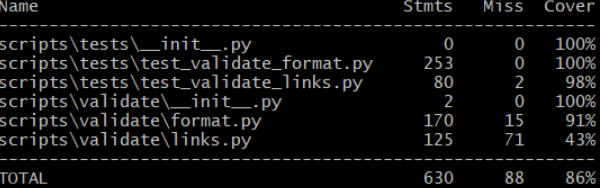

# Report for Assignment 1 resit

## Project chosen

Name: Public APIs

URL: https://github.com/DeninLunja/public-apisSEP

Number of lines of code and the tool used to count it: 1429 lizard
  

Programming language: Python

## Coverage measurement with existing tool

The tool used to check the coverage of the project was Coverage.py.

Commands used to generate the coverage report:
coverage run -m pytest scripts/tests
coverage report

## Coverage improvement

### Individual tests

Function test_find_link_in_text_with_invalid_argument
https://github.com/DeninLunja/public-apisSEP/commit/599712d945d21d50f0d3b56ba0431c171cfb406f

Old function coverage was 50%:

New function coverage is 100%:

This function has been improved. The coverage that was earlier 98% in the test_validate_links.py was increased by 2%. Now, since this is a small increase the overall coverage doesn’t change that much. The coverage improved due to 2 lines that weren't being properly executed in the test.

This was fixed by asserting TypeError to each of find_links_in_text in the following way

Function test_main_function

https://github.com/DeninLunja/public-apisSEP/commit/7177b6fbaf857fdc37feebb19fff818133868036

Old function coverage was 0%:

New function coverage is 57%:

This is a new test in test_validate_format.py which checks the main function in format.py. The coverage of main was increased by 57%. This function itself also increased the coverage of format.py by 3% (it was 91% before, now it is 94%). This also led to an increase of overall coverage by 1%. It improved because it is testing the main function which there were no test cases for.

### Overall

Overall old coverage:

Overall new coverage:
